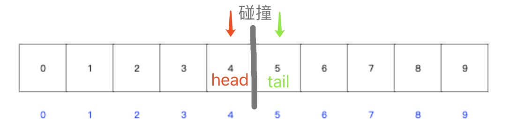

# 故事起因


在做LeetCode数组类型题目的过程中，自己有看题解，也有尝试写一些题解。
有的题解配图，有的题解只有代码。

```

代码运行过程

---------开始：输入


中间过程：
阶段一
阶段二
阶段三
...


---------结束：输出

```


假设我们没有理解代码的实现逻辑，那么中间过程对我们来说就是**黑盒**。

此时经典的"talk is cheap, show me the code"就显得有些力不从心了。


这个时候来一张类似下面这样的图，就很令人茅塞顿开：

